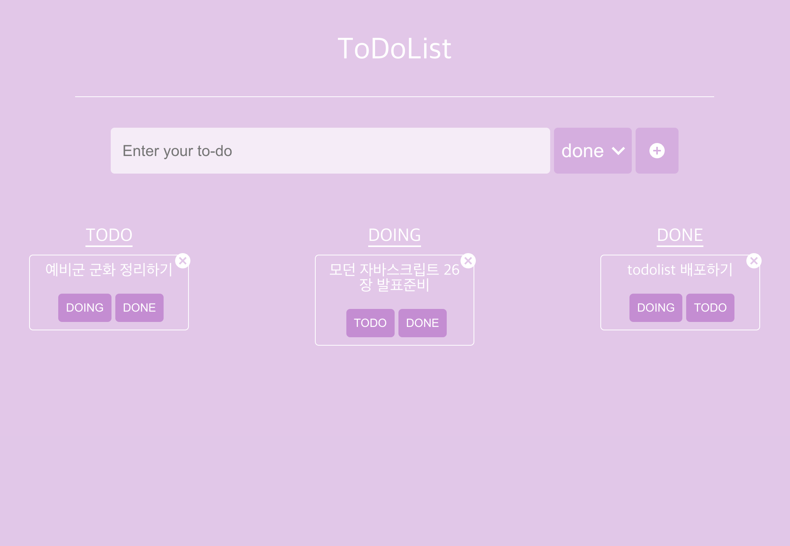

# todolist

> recoil과 react-form 활용한 todolist

## 🗓️ 기간

### 2023.10.23 ~ 2023.10.28

## ⚙️ 기술스택

### ✔️ Frond-end

<p>
  

</p>

## 💡 프로젝트를 만든 이유

### recoil selector 사용법을 익히고 react-hook-form을 활용하기 위해

## 기능 설명

<figure>
    
</figure>

### 배포 url: [https://sheepdog13.github.io/react-todo/](https://sheepdog13.github.io/react-todo/)

정리할 내용
[react form]
[recoil select]
[recoil persist]
[typescript]
[material icon]

# react hook form

### 사용하게된 계기

form을 사용할때 input이 여러개로 늘어날때 state도 늘어나고 거기에 입력 폼의 유효성 검사 까지 필요할 경우 에러 상태를 관리할 state와 검증 함수가 늘어나는등 코드는 더욱 길어지게 되기 때문에 사용했습니다.

## 1. 프로젝트 코드 리뷰

<figure>
    
</figure>

```javascript

interface IForm {
  toDo: string;
}

function CreateToDo() {
  const [category, setCategory] = useRecoilState(categoryState);
  const onInput = (event: React.FormEvent<HTMLSelectElement>) => {
    setCategory(event.currentTarget.value as any);
  };
  const [todos, setToDos] = useRecoilState(toDoState);
  const {
    register,
    handleSubmit,
    setValue,
    formState: { errors },
  } = useForm<IForm>();
  const handleValid = ({ toDo }: IForm) => {
    setToDos((oldToDos) => [
      { text: toDo, id: Date.now(), category },
      ...oldToDos,
    ]);
    setValue("toDo", "");
  };
  return (
    <Wrap>
      <Error>{errors?.toDo?.message}</Error>
      <Form onSubmit={handleSubmit(handleValid)}>
        <Input
          {...register("toDo", {
            required: "할일을 적어주세요",
          })}
          placeholder="Enter your to-do"
        />
        <SelectBox>
          <Select value={category} onInput={onInput}>
            <option value={Categories.TO_DO}>todo</option>
            <option value={Categories.DOING}>doing</option>
            <option value={Categories.DONE}>done</option>
          </Select>
          <SvgIcon component={ExpandMoreIcon} fontSize="large" />
        </SelectBox>
        <Btn>
          <SvgIcon component={AddCircleIcon} />
        </Btn>
      </Form>
    </Wrap>
  );
}

export default CreateToDo;

```

### register

react-hook-form에서 제공하는 여러가지 hook 중 1개인 useForm에 그 중에서도 register 함수에 대해 알아보겠습니다.

```javascript
<Input
  {...register("toDo", {
    required: "할일을 적어주세요",
  })}
  placeholder="Enter your to-do"
/>
```

console.log(register("toDo")) 의 결과값

<figure>
    
</figure>

위 코드를 간단하게 설명하면 ... 문법을 통하여 register 함수의 결과값 name, onChange, onBlur, ref를 input element에 손쉽게 넣어준 것입니다.

여러 input attribute(required...)를 작성할 수 있습니다.
required에 message를 넣어주었는데, handleSubmit에서 설명하겠습니다.

### handleSubmit

```javascript
const handleValid = ({ toDo }: IForm) => {
  setToDos((oldToDos) => [
    { text: toDo, id: Date.now(), category },
    ...oldToDos,
  ]);
  setValue("toDo", "");
};

<Form onSubmit={handleSubmit(handleValid)}></Form>;
```

첫번째 인자로 성공했을때 사용할 함수를 받고, 두번째 인자로 실패했을때 사욜할 함수를 받습니다.(필수값X)

handleSubmit이 실행되고 난 후 error가 발생하게 되면 errors 객체를 이용하여(해당 error 값들은 formState 객체 안의 errors에 담겨있습니다.) 사용자들에게 표시해주면 됩니다. errors 객체 형식은 아래와 같습니다.

```javascript
// errors.내가지정한 input name.message
<Error>{errors?.toDo?.message}</Error>
```

### setValue

```javascript
const handleValid = ({ toDo }: IForm) => {
  setToDos((oldToDos) => [
    { text: toDo, id: Date.now(), category },
    ...oldToDos,
  ]);
  setValue("toDo", "");
};
```

setValue("필드명", 값)
todo를 등록한후 toDo필드의 input의 value를 지우기 위해 사용

### formstate

```javascript
const {
   register,
   handleSubmit,
   setValue,
   formState: { errors },
 } = useForm<IForm>();

 // errors.내가지정한 input name.message
<Error>{errors?.toDo?.message}</Error>
```
